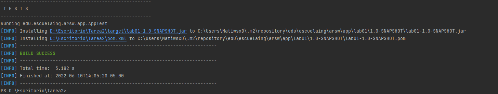
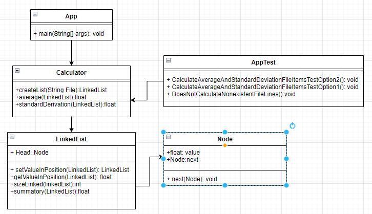

# TAREA 2 ARSW

Write a program to calculate the mean and standard deviation of a set of n real numbers.

# LOC/h. Rendimiento

1. desde las 5:00 pm, hasta las 8:30 pm - fueron en total 192 lineas
2. desde las 11:00 am, hasta las 3:00 pm - fueron en total 112 lineas


LOC = (304L/7.5h)

## 40.6 LOC

# Documentación

la documentacion de este proyecto esta en la siguiente ruta del proyecto:
```
raiz /README.md
```
## EMPEZAR

Copie el proyecto via git clone en cualquier diretorio para empezar a trabajar:
```
[Aqui el link ](https://github.com/MatiwsxD/arsw-i-lab02)
```

### Prerequisitos

Tener instalado Java jdk versiones 7+, Maven comandos y git

### Instalando

1. Ejecutar en terminal:

```
$$ mvn package
```
2.(opcional):
si requiere la documentacion del codigo ejecute y estara en raiz /target:

```
mvn javadoc:javadoc
```

2. (Demostracion):
   compile el proyecto desde la carpeta raiz ejecutando la siguiente linea dependendiendo del metodo de lectura si es 'loc' o 'phy' y poniendo la ruta del archivo a analizar (recuerde que esto entra como parametro)

```
java -cp ".\target\classes" edu.escuelaing.arsw.app.App "ruta del archivo"


```
### Pruebas

Nota: Hay dos archivos en la carpeta Test para que haga sus pruebas

### Diagrama de clases
   

## Built con

* [Maven](https://maven.apache.org/) - Dependency Management
* [JAVA JDK 8](http://www.oracle.com/technetwork/java/javase/overview/index.html) - construcción


## Autor

* **Juan Mateo Mejia Zuluaga** - *Initial work* - [MatiwsxD](https://github.com/MatiwsxD)


## Licencia

This project is licensed under the GNU General Public License - see the [LICENSE](LICENSE) file for details
